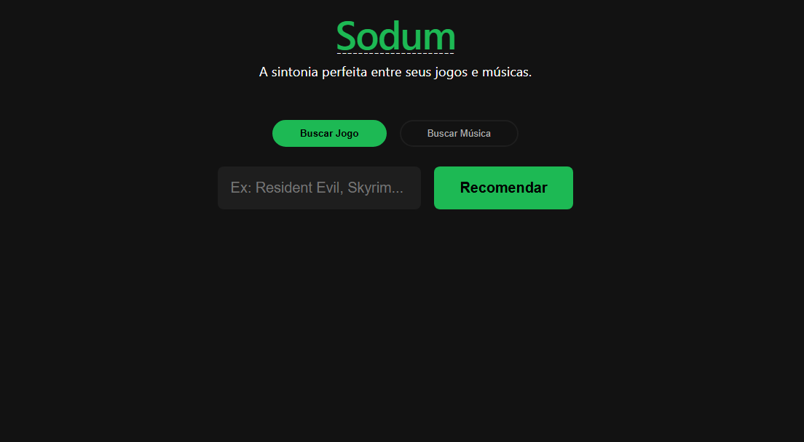
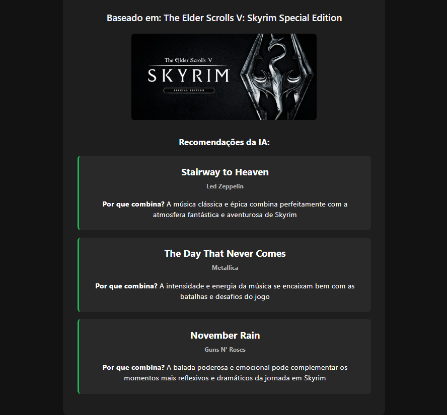
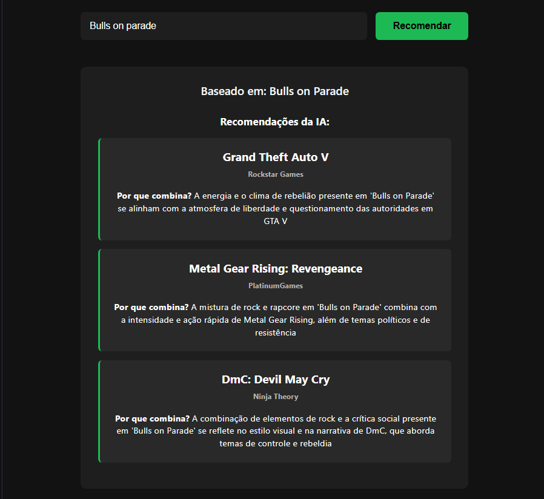

# Sodum 🎲🎵

**Sodum** é um motor de recomendação inteligente focado em **jogos e música**, impulsionado por Inteligência Artificial (LLMs). O projeto está atualmente em **desenvolvimento ativo**, com o objetivo de entregar uma aplicação web moderna que conecte os usuários aos seus próximos jogos favoritos e novas descobertas musicais através de integrações e análises de IA.

A interface da aplicação pode ser acessada em: [sodum.vercel.app](https://sodum.vercel.app/)

## 🚀 Funcionalidades (Em Desenvolvimento)

- **Motor de Recomendação via IA:** Geração de sugestões contextuais e personalizadas de jogos e músicas através do consumo de APIs de LLM.
- **Integração de APIs Externas:** Conexão com serviços de inteligência artificial e bancos de dados de entretenimento.
- **Interface Web Dinâmica:** Layout responsivo e focado na experiência do usuário (UX) para facilitar o consumo das recomendações.
- **Arquitetura Desacoplada:** Separação clara de responsabilidades, garantindo uma comunicação RESTful robusta entre a interface e o servidor.

 

## 💻 Tecnologias

**Backend:**
- C# / ASP.NET Core (Web API)
- Banco de Dados MySQL
- Integração com APIs de LLMs

**Frontend:**
- React (JavaScript, HTML, CSS)
- Deploy contínuo na Vercel

 



## 📂 Estrutura do Projeto

- `api/` - Código fonte do backend responsável pela lógica de negócios e integrações com IA (.NET).
- `front/` - Código fonte da aplicação web de interface com o usuário.
- `README.md` - Documentação principal do projeto.

## ⚙️ Como rodar localmente

### Pré-requisitos
- [.NET SDK](https://dotnet.microsoft.com/download)
- [Node.js](https://nodejs.org/) e npm
- Servidor MySQL rodando localmente ou em nuvem.

### Passos para inicialização

1. **Clone o repositório:**
   ```bash
   git clone [https://github.com/seu-usuario/sodum.git](https://github.com/seu-usuario/sodum.git)
   ```

2. **Subindo a API (Backend):**
   Navegue até a pasta da API, baixe os pacotes e rode o projeto. 
   *Nota: Lembre-se de configurar sua string de conexão do MySQL e as chaves das APIs de LLM no seu `appsettings.Development.json`.*
   ```bash
   cd sodum/api
   dotnet restore
   dotnet build
   dotnet run
   ```

3. **Subindo a Interface (Frontend):**
   Em um novo terminal, acesse a pasta do front-end e inicie o servidor de desenvolvimento.
   ```bash
   cd sodum/front
   npm install
   npm run dev
   ```

4. **Acesse:** Abra seu navegador em `http://localhost:3000` (ou na porta indicada pelo terminal do React/Vite) para ver o projeto rodando, já consumindo a API local na porta configurada pelo .NET.


Este projeto está sendo desenvolvido e aprimorado ativamente. Para dúvidas sobre a arquitetura da aplicação ou o funcionamento das integrações com os LLMs, sinta-se à vontade para abrir uma *issue* no repositório.
```
